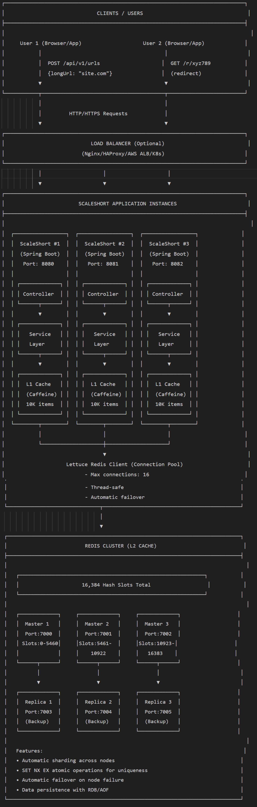

# ScaleShort

A production-ready distributed URL shortener with two-tier caching (Caffeine+Redis), handling 26K QPS with sub-40ms P99 latency for scalable deployments.

# ScaleShort Architecture Diagram



## Quick Start

### Prerequisites

**Java 17**
```bash
sudo apt-get update && sudo apt-get install -y openjdk-17-jdk
java -version  # Should show: openjdk version "17.0.x"
```

**Redis** 
```bash
sudo apt-get install -y redis-server
sudo systemctl start redis && sudo systemctl enable redis
redis-cli ping  # Should return: PONG
```

**Docker (Optional for cluster mode)**
```bash
curl -fsSL https://get.docker.com -o get-docker.sh
sudo sh get-docker.sh
sudo apt-get install -y docker-compose
```

### Build & Run

```bash
# Build project
./gradlew clean build

# Run with local Redis (development)
java -jar build/libs/scaleshort-1.0.0.jar --spring.profiles.active=local

# Run with Redis Cluster (production)
docker-compose up -d
```

## API Documentation

### Endpoints

| Method | Endpoint | Description |
|--------|----------|-------------|
| POST | `/api/v1/urls` | Create short URL |
| GET | `/api/v1/urls/{code}` | Get original URL |
| GET | `/r/{code}` | Redirect to original URL |
| GET | `/actuator/health` | Health check |

### Examples

**Create Short URL**
```bash
curl -X POST http://localhost:8080/api/v1/urls \
  -H 'Content-Type: application/json' \
  -d '{"longUrl":"https://example.com","ttlSeconds":3600}'

# Response: {"code":"aBc1234","shortUrl":"http://localhost:8080/r/aBc1234"}
```

**Get Original URL**
```bash
curl http://localhost:8080/api/v1/urls/aBc1234
# Response: {"longUrl":"https://example.com"}
```

**Redirect**
```bash
curl -I http://localhost:8080/r/aBc1234
# Returns: HTTP 302 with Location header
```

## Architecture

- **Spring Boot 3.2.0** - Microservice framework
- **Redis Cluster** - Distributed storage with 16,384 hash slots
- **Caffeine Cache** - L1 in-memory cache with W-TinyLFU eviction
- **Lettuce Client** - Thread-safe Redis client with connection pooling
- **Two-tier Caching**: 
  - L1 Caffeine: Sub-millisecond reads for hot data
  - L2 Redis: Distributed persistent storage

## Configuration

### Environment Variables

| Variable | Description | Default |
|----------|-------------|---------|
| `SPRING_PROFILES_ACTIVE` | Profile (local/production) | `local` |
| `SPRING_REDIS_CLUSTER_NODES` | Redis nodes | `localhost:7000,...` |
| `DEFAULT_TTL_SECONDS` | URL expiration | `2592000` (30 days) |
| `APP_BASE_URL` | Base URL for short links | `http://localhost:8080` |
| `CAFFEINE_MAX_SIZE` | L1 cache entries | `10000` |

### Application Profiles

- **local**: Single Redis instance for development
- **production**: Full Redis Cluster with replicas
- **docker**: Containerized deployment

## Performance

- **4,500 QPS** for URL creation (writes)
- **26,000 QPS** for URL retrieval (reads)  
- **P99 < 40ms** for all operations
- **10x faster** than Redis-only solution
